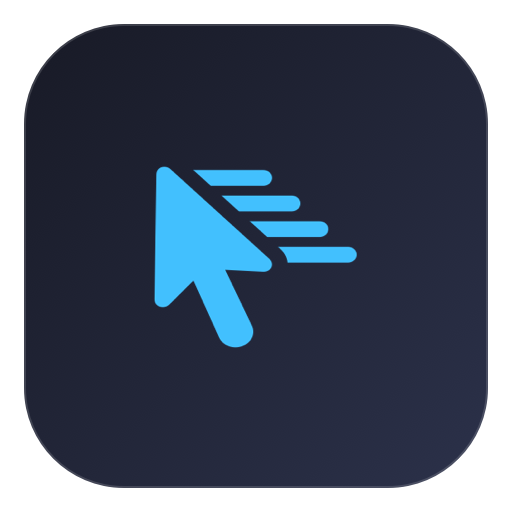

<p align="center">
  
</p>

<h1 align="center">MoveMouse</h1>

<p align="center">
  <strong>Automatic mouse movement, on your schedule.</strong>
</p>

An open-source macOS menu bar app that automatically moves your mouse pointer at a configurable interval. Choose a movement pattern, adjust the timing, and start or pause movement from the menu bar.

MoveMouse is useful whenever you need repeatable pointer movement, such as desktop demonstrations, testing mouse interactions, or keeping your Mac active during a task. Built with Swift and AppKit, it runs without a Dock icon.

## Features

- **Configurable timing:** move every 15, 30, or 45 seconds, or every 1, 2, or 5 minutes.
- **Two movement patterns:** move around the screen center or wiggle around the pointer's current position.
- **Optional left click:** perform one click after each movement, with optional sound feedback.
- **Simple controls:** start, pause, move immediately, or quit from the menu bar.
- **Status at a glance:** see whether movement is running and when the last operation occurred.
- **Saved preferences:** interval, movement pattern, click, and sound settings persist between launches.
- **Sleep prevention:** prevent idle system sleep while automatic movement is running; pausing or quitting releases it.

## Requirements

- macOS 11 Big Sur or later.
- An Apple Silicon Mac for the included app and current build script, which targets `arm64`.
- Xcode Command Line Tools to build from source.
- Accessibility permission for simulated mouse input, particularly clicking.

The current interface uses Arabic labels, with English labels for several controls, including Start, Pause, Move Now, Interval, and Left Click.

## Getting started

Clone the repository and build the app:

```bash
git clone https://github.com/Alhamou/moveMouse.git
cd moveMouse
./build.sh
./run.sh
```

If the Swift compiler is unavailable, install Xcode Command Line Tools with `xcode-select --install`, then run the build again.

The build script creates `MoveMouse.app` in the project directory and signs it locally with an ad-hoc signature. You can also launch it by opening the app in Finder. To use the included app without rebuilding, run `./run.sh`.

MoveMouse appears in the macOS menu bar and starts automatic movement on launch. Open its menu to configure the behavior or pause it.

## Settings and controls

| Setting | Options | First-launch default |
| --- | --- | --- |
| Interval | 15 s, 30 s, 45 s, 1 min, 2 min, 5 min | 30 seconds |
| Movement pattern | Screen center or current pointer position | Screen center |
| Left Click | Click once after movement | Enabled |
| Click Sound | Play a sound after clicking | Enabled |

**Screen center** moves the pointer to the center, then right and left, and finishes at the center. **Current pointer position** moves it a short distance right and left, then returns it to its starting position.

To use movement only, turn off **Left Click**. When enabled, the click occurs at the final pointer position and interacts with whatever is underneath it. **Click Sound** is available when clicking is enabled.

- **Pause / Start:** stop or resume scheduled movement and idle sleep prevention.
- **Move Now:** perform one movement immediately using the current settings, including while paused.
- **Quit:** stop movement and close the app.

You can also stop the app from the project directory:

```bash
./stop.sh
```

## Accessibility permission

On first launch, macOS may ask you to allow MoveMouse to control mouse input. Grant access through:

1. Open **System Settings → Privacy & Security → Accessibility**. On macOS Big Sur or Monterey, use **System Preferences → Security & Privacy → Privacy → Accessibility**.
2. Enable **MoveMouse**, or add `MoveMouse.app` if it is not listed.
3. Relaunch the app if the permission change is not recognized.

The Accessibility item in the app's menu opens the relevant settings. If clicking stops working after rebuilding or moving the app, remove its existing Accessibility entry, add the app again, and relaunch it.

## Launch at login

To start MoveMouse when you sign in, add `MoveMouse.app` to your macOS login items. On recent macOS versions, open **System Settings → General → Login Items**, then add the app under **Open at Login**. On Big Sur or Monterey, use **System Preferences → Users & Groups → Login Items**.

MoveMouse starts scheduled movement whenever it launches, using your saved settings.

## Development and contributing

The project uses native macOS frameworks and builds directly with `swiftc`; no third-party dependencies or Xcode project are required.

| File | Purpose |
| --- | --- |
| `src/main.swift` | Application entry point |
| `src/AppDelegate.swift` | Menu bar interface and controls |
| `src/MouseMover.swift` | Movement timer, pointer input, and saved preferences |
| `src/SleepManager.swift` | Idle system sleep prevention |
| `build.sh` | Compile, package, and locally sign the app |
| `run.sh` / `stop.sh` | Launch or stop the app |

Bug reports, feature suggestions, documentation improvements, and pull requests are welcome. [Open an issue](https://github.com/Alhamou/moveMouse/issues) with the macOS version, steps to reproduce, and expected behavior. For code changes, rebuild with `./build.sh` and manually check the affected menu controls and movement behavior before submitting a pull request.

## License

MoveMouse is released under the [MIT License](LICENSE).
